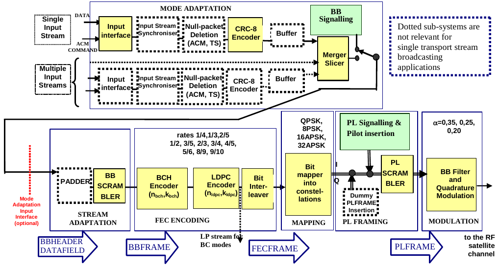

# DVB FPGA


This project aims to implement RTL components for DVB-S2, initially focusing on
the transmission side.

|                         |
| :---:                                                                       |
| Functional block diagram of the DVB-S2 System from ETSI EN 302 307-1 V1.4.1 |

## Functional guidelines

* Behaviour should match exactly what GNU Radio produces for every combination of
  parameters described on the DVB-S2 base spec (no extensions yet). This means
  components should handle
  * Frame types: Normal and short
  * Constellations: 8 PSK, 16 APSK and 32 APSK
  * Code rates: 1/4, 1/3, 2/5, 1/2, 3/5, 2/3, 3/4, 4/5, 5/6, 8/9, 9/10,
* Components should also handle parameters changing on every frame, that is, they
  should handle frame with config A then a frame with config B immediately
  afterwards without requiring reset or wait cycles
* Use AXI-Stream interfaces

## Components' status

<!-- Definitions of each development stage: -->

<!-- * Simulation -->
<!--   * Data must match GNU Radio's output -->
<!--   * **Back to back data:** check no bubbles are inserted -->
<!--   * **Slow reader:** check that AXI backpressure works as expected -->
<!--   * **Slow writer:** check that output data is throttled correctly -->
<!--   * **Slow write and reader:** check AXI handshaking works as expected -->
<!-- * Hardware testing -->
<!--   * Check components is synthesized/implemented as expected by EDA tools -->
<!--   * Check for possible timing issues (too many logic levels, unintended latches, -->
<!--     etc) -->
<!--   [> * Still TBD. Basic idea is to stream data in/out via PCIe or DDR where the host <] -->
<!--   [>   compares the actual and the expected results <] -->
<!--   [> * Might be interesting to have a generic GNU Radio to PCIe bridge so that one <] -->
<!--   [>   could offload create a block diagram on GRC and run parts of it on a real <] -->
<!--   [>   card <] -->
<!-- * Hardware integration -->
<!--   * Same as hardware testing but chaining components together to check it handles -->
<!--     multiple configs as expected -->
<!--   * Check that timing constraints are met when components are used together -->

### Core DVB-S2 components

| Component name         | Simulation | HW testing | HW integration |
| :---                   | :---:      | :--:       | :--:           |
| Baseband scrambler     | ✔️          | TODO       | TODO           |
| BCH encoder            | ✔️          | TODO       | TODO           |
| Bit interleaver        | ✔️          | TODO       | TODO           |
| Constellation mapper   | TODO       | TODO       | TODO           |
| LDPC Encoder           | ✔️          | TODO       | TODO           |
| Physical layer framing | TODO       | TODO       | TODO           |

### Performance and resource usage (WIP)

The [dvb_fpga/rtl/dvbs2_tx.vhd](https://github.com/phase4ground/dvb_fpga/blob/master/rtl/dvbs2_tx.vhd)
top level has been run through Vivado targeting a `xczu4cg-sfvc784-1LV-i` and
with a clock frequency of 333 MHz (both arbitrary). No timing issues were
reported and the resource usage post implementation is as follows:

| Resource | Usage |
|:---      | :--:  |
| LUT      | 2864  |
| LUTRAM   | 106   |
| FF       | 2197  |
| BRAM     | 16    |

## Running tests

Tests can be run locally or on a Docker container. Running locally will require
GNU Radio, VUnit and a VHDL simulator.

### Using Docker

Uses the same container used for CI

```sh
# Clone this repo and submodules
git clone --recurse-submodules  https://github.com/phase4ground/dvb_fpga
cd dvb_fpga
# Run the tests
./misc/run_tests.sh
```

Arguments passed to `docker/run_tests.sh` will be passed to `run.py` and, by
extension, to VUnit (no environment variable is passed on though). This will
generate gnuradio_data (test data).

### Running locally

* Requirements
  * GNU Radio
  * A VHDL simulator
  * [VUnit][vunit]

```sh
# Install VUnit
pip install vunit-hdl
# Clone this repo and submodules
git clone --recurse-submodules  https://github.com/phase4ground/dvb_fpga
cd dvb_fpga
# Run the tests
./run.py
```
The first invocation of `run.py` will run GNURadio and create stimulus files.

To list tests use `./run.py -l`:
```sh
$ ./run.py -l
lib.axi_bit_interleaver_tb.data_width=8,all_parameters.back_to_back
lib.axi_bit_interleaver_tb.data_width=8,all_parameters.slow_master
lib.axi_bit_interleaver_tb.data_width=8,all_parameters.slow_slave
lib.axi_bit_interleaver_tb.data_width=8,all_parameters.both_slow
lib.axi_ldpc_table_tb.test_all_configs.back_to_back
lib.axi_ldpc_table_tb.test_all_configs.slow_master
lib.axi_ldpc_table_tb.test_all_configs.slow_slave
lib.axi_ldpc_table_tb.test_all_configs.slow_master,slow_slave
lib.axi_bch_encoder_tb.test_all_configs.back_to_back
lib.axi_bch_encoder_tb.test_all_configs.slow_master
lib.axi_bch_encoder_tb.test_all_configs.slow_slave
lib.axi_bch_encoder_tb.test_all_configs.both_slow
lib.dvbs2_tx_tb.test_all_configs.back_to_back
lib.axi_ldpc_encoder_core_tb.test_all_configs.back_to_back
lib.axi_ldpc_encoder_core_tb.test_all_configs.data=0.5,table=1.0,slave=1.0
lib.axi_ldpc_encoder_core_tb.test_all_configs.data=1.0,table=1.0,slave=0.5
lib.axi_ldpc_encoder_core_tb.test_all_configs.data=0.75,table=1.0,slave=0.75
lib.axi_ldpc_encoder_core_tb.test_all_configs.data=1.0,table=0.5,slave=1.0
lib.axi_ldpc_encoder_core_tb.test_all_configs.data=1.0,table=0.75,slave=0.75
lib.axi_ldpc_encoder_core_tb.test_all_configs.data=0.8,table=0.8,slave=0.8
lib.axi_baseband_scrambler_tb.test_all_configs.back_to_back
lib.axi_baseband_scrambler_tb.test_all_configs.slow_master
lib.axi_baseband_scrambler_tb.test_all_configs.slow_slave
lib.axi_baseband_scrambler_tb.test_all_configs.both_slow
Listed 24 tests
```
## Running synthesis

Scripts are provided as an example to get things going, currently this has not
been tested in real hardware.

### Yosys

```sh
./misc/run_synth.sh
```

### Vivado

```sh
vivado -source ./build/vivado/build.tcl
```

[vunit]: https://vunit.github.io/
[issue_1]: https://github.com/phase4ground/dvb_fpga/issues/1
