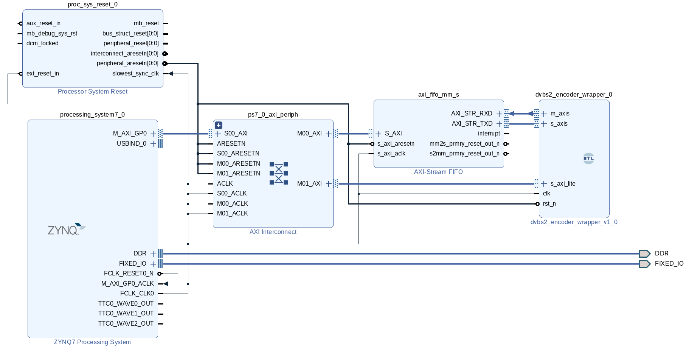

# ZC706

This directory contains scripts to build a test design on the [ZC706] evaluation
board. An [AXI Stream FIFO] is used to loop data to/from the DVB encoder.

The design's block diagram is shown below

|  |
| :---:                                                                   |
| **ZC706 test design block diagram**                                     |

## Memory map

| Address range                  | Name                                 |
| :---:                          | :---                                 |
| `0x43C0_0000` to `0x43C0_FFFF` | `axi_data_fifo/S_AXI`                |
| `0x43C1_0000` to `0x43C1_FFFF` | `dvbs2_encoder_wrapper_0/s_axi_lite` |
| `0x43C2_0000` to `0x43C0_FFFF` | `axi_metadata_fifo/S_AXI`            |

## Data interface

Data is sent to the DVB encoder using `axi_data_fifo/AXI_STR_TXD`, while frame
configuration is sent using `axi_metadata_fifo/AXI_STR_TXD`. The mapping between
metadata values and frame parameters is show below:

| s_axis.tid value | Frame length    | Constellation | Code rate |
| :---:            | :----           | :---:         | :---:     |
| 0x00             | FECFRAME_SHORT  | QPSK          | 1/4       |
| 0x01             | FECFRAME_SHORT  | QPSK          | 1/3       |
| 0x02             | FECFRAME_SHORT  | QPSK          | 2/5       |
| 0x03             | FECFRAME_SHORT  | QPSK          | 1/2       |
| 0x04             | FECFRAME_SHORT  | QPSK          | 3/5       |
| 0x05             | FECFRAME_SHORT  | QPSK          | 2/3       |
| 0x06             | FECFRAME_SHORT  | QPSK          | 3/4       |
| 0x07             | FECFRAME_SHORT  | QPSK          | 4/5       |
| 0x08             | FECFRAME_SHORT  | QPSK          | 5/6       |
| 0x09             | FECFRAME_SHORT  | QPSK          | 8/9       |
| 0x0A             | FECFRAME_SHORT  | QPSK          | 9/10      |
| 0x0B             | FECFRAME_SHORT  | 8PSK          | 1/4       |
| 0x0C             | FECFRAME_SHORT  | 8PSK          | 1/3       |
| 0x0D             | FECFRAME_SHORT  | 8PSK          | 2/5       |
| 0x0E             | FECFRAME_SHORT  | 8PSK          | 1/2       |
| 0x0F             | FECFRAME_SHORT  | 8PSK          | 3/5       |
| 0x10             | FECFRAME_SHORT  | 8PSK          | 2/3       |
| 0x11             | FECFRAME_SHORT  | 8PSK          | 3/4       |
| 0x12             | FECFRAME_SHORT  | 8PSK          | 4/5       |
| 0x13             | FECFRAME_SHORT  | 8PSK          | 5/6       |
| 0x14             | FECFRAME_SHORT  | 8PSK          | 8/9       |
| 0x15             | FECFRAME_SHORT  | 8PSK          | 9/10      |
| 0x16             | FECFRAME_SHORT  | 16APSK        | 1/4       |
| 0x17             | FECFRAME_SHORT  | 16APSK        | 1/3       |
| 0x18             | FECFRAME_SHORT  | 16APSK        | 2/5       |
| 0x19             | FECFRAME_SHORT  | 16APSK        | 1/2       |
| 0x1A             | FECFRAME_SHORT  | 16APSK        | 3/5       |
| 0x1B             | FECFRAME_SHORT  | 16APSK        | 2/3       |
| 0x1C             | FECFRAME_SHORT  | 16APSK        | 3/4       |
| 0x1D             | FECFRAME_SHORT  | 16APSK        | 4/5       |
| 0x1E             | FECFRAME_SHORT  | 16APSK        | 5/6       |
| 0x1F             | FECFRAME_SHORT  | 16APSK        | 8/9       |
| 0x20             | FECFRAME_SHORT  | 16APSK        | 9/10      |
| 0x21             | FECFRAME_SHORT  | 32APSK        | 1/4       |
| 0x22             | FECFRAME_SHORT  | 32APSK        | 1/3       |
| 0x23             | FECFRAME_SHORT  | 32APSK        | 2/5       |
| 0x24             | FECFRAME_SHORT  | 32APSK        | 1/2       |
| 0x25             | FECFRAME_SHORT  | 32APSK        | 3/5       |
| 0x26             | FECFRAME_SHORT  | 32APSK        | 2/3       |
| 0x27             | FECFRAME_SHORT  | 32APSK        | 3/4       |
| 0x28             | FECFRAME_SHORT  | 32APSK        | 4/5       |
| 0x29             | FECFRAME_SHORT  | 32APSK        | 5/6       |
| 0x2A             | FECFRAME_SHORT  | 32APSK        | 8/9       |
| 0x2B             | FECFRAME_SHORT  | 32APSK        | 9/10      |
| 0x2C             | FECFRAME_NORMAL | QPSK          | 1/4       |
| 0x2D             | FECFRAME_NORMAL | QPSK          | 1/3       |
| 0x2E             | FECFRAME_NORMAL | QPSK          | 2/5       |
| 0x2F             | FECFRAME_NORMAL | QPSK          | 1/2       |
| 0x30             | FECFRAME_NORMAL | QPSK          | 3/5       |
| 0x31             | FECFRAME_NORMAL | QPSK          | 2/3       |
| 0x32             | FECFRAME_NORMAL | QPSK          | 3/4       |
| 0x33             | FECFRAME_NORMAL | QPSK          | 4/5       |
| 0x34             | FECFRAME_NORMAL | QPSK          | 5/6       |
| 0x35             | FECFRAME_NORMAL | QPSK          | 8/9       |
| 0x36             | FECFRAME_NORMAL | QPSK          | 9/10      |
| 0x37             | FECFRAME_NORMAL | 8PSK          | 1/4       |
| 0x38             | FECFRAME_NORMAL | 8PSK          | 1/3       |
| 0x39             | FECFRAME_NORMAL | 8PSK          | 2/5       |
| 0x3A             | FECFRAME_NORMAL | 8PSK          | 1/2       |
| 0x3B             | FECFRAME_NORMAL | 8PSK          | 3/5       |
| 0x3C             | FECFRAME_NORMAL | 8PSK          | 2/3       |
| 0x3D             | FECFRAME_NORMAL | 8PSK          | 3/4       |
| 0x3E             | FECFRAME_NORMAL | 8PSK          | 4/5       |
| 0x3F             | FECFRAME_NORMAL | 8PSK          | 5/6       |
| 0x40             | FECFRAME_NORMAL | 8PSK          | 8/9       |
| 0x41             | FECFRAME_NORMAL | 8PSK          | 9/10      |
| 0x42             | FECFRAME_NORMAL | 16APSK        | 1/4       |
| 0x43             | FECFRAME_NORMAL | 16APSK        | 1/3       |
| 0x44             | FECFRAME_NORMAL | 16APSK        | 2/5       |
| 0x45             | FECFRAME_NORMAL | 16APSK        | 1/2       |
| 0x46             | FECFRAME_NORMAL | 16APSK        | 3/5       |
| 0x47             | FECFRAME_NORMAL | 16APSK        | 2/3       |
| 0x48             | FECFRAME_NORMAL | 16APSK        | 3/4       |
| 0x49             | FECFRAME_NORMAL | 16APSK        | 4/5       |
| 0x4A             | FECFRAME_NORMAL | 16APSK        | 5/6       |
| 0x4B             | FECFRAME_NORMAL | 16APSK        | 8/9       |
| 0x4C             | FECFRAME_NORMAL | 16APSK        | 9/10      |
| 0x4D             | FECFRAME_NORMAL | 32APSK        | 1/4       |
| 0x4E             | FECFRAME_NORMAL | 32APSK        | 1/3       |
| 0x4F             | FECFRAME_NORMAL | 32APSK        | 2/5       |
| 0x50             | FECFRAME_NORMAL | 32APSK        | 1/2       |
| 0x51             | FECFRAME_NORMAL | 32APSK        | 3/5       |
| 0x52             | FECFRAME_NORMAL | 32APSK        | 2/3       |
| 0x53             | FECFRAME_NORMAL | 32APSK        | 3/4       |
| 0x54             | FECFRAME_NORMAL | 32APSK        | 4/5       |
| 0x55             | FECFRAME_NORMAL | 32APSK        | 5/6       |
| 0x56             | FECFRAME_NORMAL | 32APSK        | 8/9       |
| 0x57             | FECFRAME_NORMAL | 32APSK        | 9/10      |

[build_directory]: github.com/phase4ground/dvb_fpga/tree/master/build/vivado/zc706
[zc706]: https://www.xilinx.com/products/boards-and-kits/ek-z7-zc706-g.html
[AXI Stream FIFO]: https://www.xilinx.com/support/documentation/ip_documentation/axi_fifo_mm_s/v4_1/pg080-axi-fifo-mm-s.pdf
